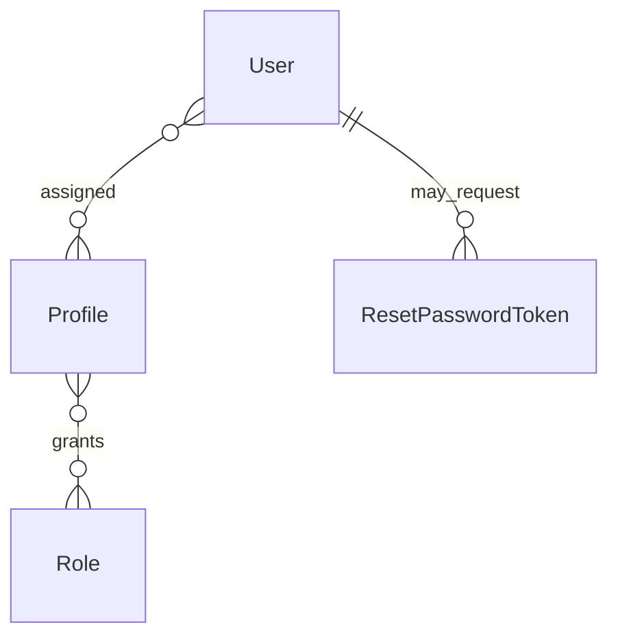

# Passport — Domain Specification

Canonical domain language for Passport, the central identity and authorization service. Developers, reviewers, and AI agents must align code, tests, and UI copy with this document.

**Related references:** [ARCHITECTURE.md](../ARCHITECTURE.md).

**Maintenance:** Update this file before merging when domain concepts change (see [.cursor/rules/domain-model.mdc](../.cursor/rules/domain-model.mdc)).

---

## Context

Passport manages **users**, groups them via **profiles**, and grants **roles** used by platform services (Backoffice, Visita, etc.). Authentication is email + password → **JWT** with flattened role claims.

---

## Ubiquitous Language

### Platform & people

| Term | Meaning | Code / notes |
|------|---------|--------------|
| **Passport** | Identity and authorization product. | — |
| **User** | Person account: username, display name, email, password, active/disabled. | `User`, `tb_users` |
| **Profile** | Named set of roles assigned to users (e.g. "Passport Admin"). | `Profile`, `tb_profiles` |
| **Role** | Permission string consumed by downstream services (JWT `groups`). | `Role`, `tb_roles` |
| **Passport administrator** | Role `passport.admin`; manage users, profiles, roles. | `RequiredRoles.ADMIN` |
| **Domain administrator** | Role `domains.admin`; manage Visita domains (via profile). | JWT group |
| **Domain editor** | Role `Domain.Editor`; edit domain settings in Visita. | JWT group |
| **Domain stats viewer** | Role `Domain.Stats.Viewer`; view Visita analytics. | JWT group |
| **Disabled user** | User who cannot log in. | `User.disabled` |
| **Disabled profile** | Profile excluded from authorization. | `Profile.disabled` |

### Authentication

| Term | Meaning | Code / notes |
|------|---------|--------------|
| **Login** | Authenticate with email and password; returns **JWT**. | `LoginEndpoint`, `POST /auth/login` |
| **JWT** | Signed token with user id, username, email, role **groups**. | `JwtGenerator` |
| **Current user** | Authenticated user from JWT. | `CurrentUserEndpoint`, `GET /auth/me` |
| **Encoded password** | PBKDF2-hashed secret; never returned in API. | `PasswordEncoder`, `User.encodedPassword` |
| **Change password** | Authenticated user sets a new password. | `ChangePasswordEndpoint` |
| **Password reset request** | Email with link to reset password. | `RequestResetPasswordEndpoint` |
| **Reset password token** | Single-use secret (hashed at rest). | `ResetPasswordToken` |
| **Confirm password reset** | Set new password using token from email. | `ConfirmResetPasswordEndpoint` |

### User management actions

| Term | Meaning | Code / notes |
|------|---------|--------------|
| **Create user** | Register username, name, email; system assigns initial password. | `CreateUserEndpoint` |
| **Update user** | Change name, username, email. | `UpdateUserEndpoint` |
| **Assign profiles** | Replace user's profile set. | `AssignProfilesEndpoint` |
| **Enable user** | Set `disabled = false`. | `EnableUserEndpoint` |
| **Disable user** | Set `disabled = true`; blocks login. | `DisableUserEndpoint` |
| **Search users** | Filter by name, email, username, profiles, disabled. | `SearchUserEndpoint` |

### Profile management actions

| Term | Meaning | Code / notes |
|------|---------|--------------|
| **Create profile** | New named profile. | `CreateProfileEndpoint` |
| **Assign roles** | Replace profile's role set. | `AssignRolesEndpoint` |
| **Enable profile** | Activate profile for authorization. | `EnableProfileEndpoint` |
| **Disable profile** | Deactivate profile. | `DisableProfileEndpoint` |
| **Delete profile** | Remove profile (when supported by UI). | Backoffice confirm dialog |

### Role management actions

| Term | Meaning | Code / notes |
|------|---------|--------------|
| **Create role** | New permission string. | `CreateRoleEndpoint` |
| **Delete role** | Remove role from catalog. | `DeleteRoleEndpoint` |

### Notifications

| Term | Meaning | Code / notes |
|------|---------|--------------|
| **Notification** | Cross-service event (e.g. Engage sync run) stored once with title, description, report JSON. | `Notification`, `tb_notifications` |
| **Notification item** | One sub-report per outbound API call (operation, outcome, counts). | `NotificationItem`, `tb_notification_items` |
| **User notification** | Per-user delivery row with read state. | `UserNotification`, `tb_user_notifications` |
| **Read state** | `read`, `read_at`, `opened_at` on user notification. | `UserNotification.markRead()`, `markOpened()` |
| **Channel follow** | User subscription to an Engage channel id for notification fan-out. | `ChannelFollow`, `tb_channel_follows` |
| **Internal notification** | Service-to-service create via `X-Service-Key`. | `CreateInternalNotificationEndpoint` |
| **Purge old read notifications** | Scheduled job removes read deliveries older than 2 days; deletes orphan notifications with no remaining deliveries. | `PurgeOldReadNotificationsTask` |

### Dev personas (seed data)

| Username | Profiles | Typical use |
|----------|----------|-------------|
| `cto-boss` | Domain Manager, Domain Viewer, Passport Admin | Full admin + domain roles; follows Engage channel id `1` |
| `junior` | (none) | User without elevated roles |
| `guest-user` | (none) | Minimal account |

Dev password: `qwas1234` (see `application.properties` / dev-import).

### Backoffice UI labels (pt-BR)

| Label | Domain term |
|-------|-------------|
| Usuários | User list |
| Perfis | Profile list |
| Funções | Role list |
| Acessar | Login |
| Sair | Logout (end session) |
| Conta | Account settings |

---

## Invariants

1. A **User** has zero or more **Profiles**; effective permissions = union of all roles on non-disabled profiles.
2. **Login** succeeds only for non-disabled users with matching password.
3. **JWT groups** contain role **names** (strings), not profile names.
4. **Username** is unique, max 15 characters; **email** is unique.
5. Password reset tokens are single-use and time-limited.
